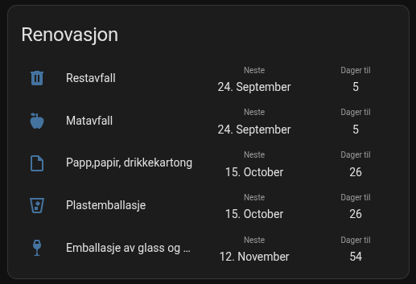
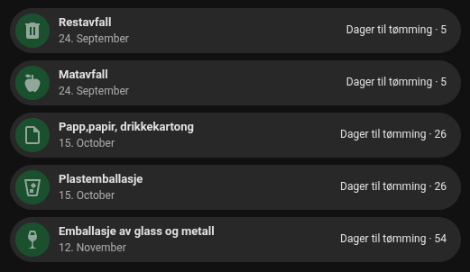

# Min Renovasjon

[](https://github.com/hacs/integration)

<a href="https://buymeacoffee.com/audunsimonp" target="_blank"></a>

Home Assistant integration of the norwegian Min Renovasjon app.

## Installation
Under HACS -> Integrations, add custom repository "https://github.com/eyesoft/home_assistant_min_renovasjon/" with Category "Integration". 

Search for repository "Min Renovasjon" and download it. Restart Home Assistant.

Go to Settings > Integrations and Add Integration "Min Renovasjon". Type in address to search, e.g. "Min gate 12, 0153" (street address comma zipcode).

Click Configure and choose fractions to create sensors.

Restart Home Assistant.

## Upgrade from version pre 2.0.0
Install component and configure it as described under Installation. 

If everything work as before after the restart, the old integration "min_renovasjon" and sensor "min_renovasjon" can be deleted from configuration.yaml

## Example yaml cards

### Auto-entities + multiple-entity-row

Shows next 5 pickups with days to pickup and date, sorted by days to pickup.



<details>
    <summary>Show yaml</summary>

```yaml
type: custom:auto-entities
card:
  type: entities
  show_header_toggle: false
  state_color: false
  title: Renovasjon
sort:
  method: attribute
  attribute: days_to_pickup
  numeric: true
  reverse: false
  count: 5
  ignore_case: true
filter:
  include:
    - domain: sensor
      attributes:
        days_to_pickup: ">=0"
      options:
        entity: this.entity_id
        type: custom:multiple-entity-row
        show_state: false
        entities:
          - attribute: formatted_date
            styles:
              width: 120px
              text-align: center
            name: Neste
          - attribute: days_to_pickup
            styles:
              width: 100px
              text-align: center
            name: Dager til
```

</details>

### Auto-entities + bubble-card

Shows next 5 pickups with days to pickup and date, sorted by days to pickup.



<details>
    <summary>Show yaml</summary>

```yaml
type: custom:auto-entities
card:
  type: vertical-stack
card_param: cards
filter:
  include:
    - domain: sensor
      attributes:
        days_to_pickup: ">=0"
      options:
        type: custom:bubble-card
        card_type: button
        button_type: state
        grid_options:
          columns: 12
          rows: 1
        card_layout: normal
        sub_button:
          - entity: this.entity_id
            show_attribute: true
            attribute: days_to_pickup
            show_icon: false
            show_background: false
            name: Dager til tømming
            show_name: true
        styles: |
          ha-card {
            --bubble-button-icon-background-color: rgba(12,120,50,0.5) !important;
          }
sort:
  method: attribute
  attribute: days_to_pickup
  numeric: true
  reverse: false
  count: 5
  ignore_case: true
```

</details>